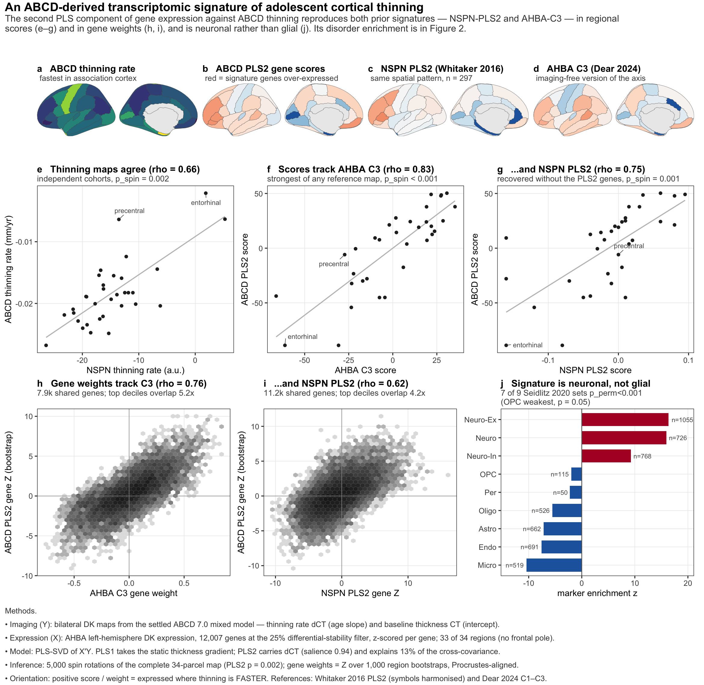
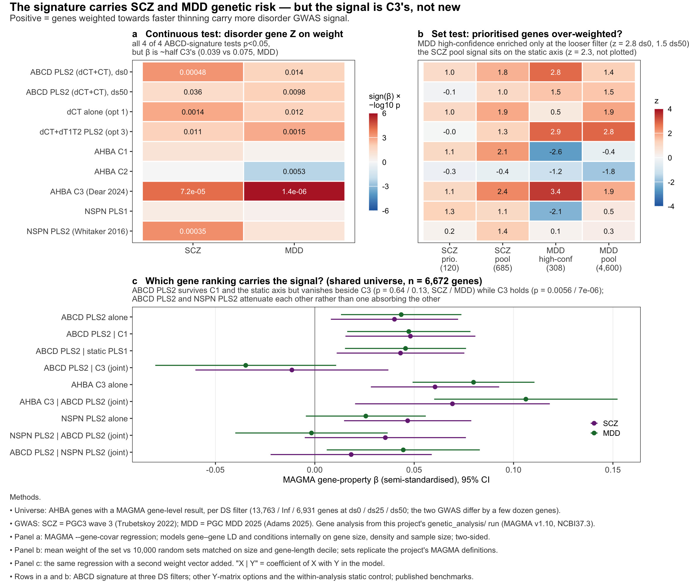

```{python}
#| echo: false
import sys
from pathlib import Path
import pandas as pd
from IPython.display import Markdown, Image

HERE = Path.cwd() if (Path.cwd() / "results").exists() else Path("ahba_pls")
RES, FIG, DATA = HERE / "results", HERE / "figures", HERE / "data"
sys.path.insert(0, str(HERE / "code"))
pd.set_option("display.width", 200)
def show(df, **kw): return Markdown(df.to_markdown(index=kw.pop("index", False), **kw))
```

## The question, and why it is worth re-asking

Whitaker, Vértes et al. (2016, *PNAS* [10.1073/pnas.1601745113](https://doi.org/10.1073/pnas.1601745113))
took a longitudinal adolescent MRI sample (NSPN, 297 subjects, two scans) with four
regional measures — cortical thickness, its rate of change, magnetization transfer and
its rate of change — and ran PLS against Allen Human Brain Atlas expression. Their second
component (PLS2) was enriched for schizophrenia GWAS genes, which made "the transcriptomic
signature of adolescent cortical shrinkage" a concrete gene list rather than a metaphor.

Dear et al. (2024, *Nat Neurosci* [10.1038/s41593-024-01624-4](https://doi.org/10.1038/s41593-024-01624-4))
showed the same axis falls out of the AHBA *alone*, as its third principal component (C3),
with no imaging in the loop — and carries the same SCZ enrichment (and MDD, with the 2025
Adams GWAS). That is a stronger claim about the transcriptome but a weaker one about
development: C3 is defined without reference to any developmental measure.

The ABCD gives a thinning map from ~8,200 subjects rather than 297. So: **if we go back to
the imaging-transcriptomics route with a discovery sample ~30× larger (8,716 children
against NSPN's ~300), do we recover the
same signature, and is it a sharper gene list than C3?**

Two things constrain the design. The ABCD has no magnetization transfer, so the PNAS
four-measure matrix cannot be reproduced exactly — T1w/T2w ratio is the available myelin
proxy. And the AHBA covers only 33 of 34 Desikan–Killiany regions per hemisphere, against
NSPN's 308-region parcellation, so every effect here is measured on 33 points.

## Design

### X — expression

AHBA left-hemisphere DK expression from `AHBA_updated`
(`ahba_dk_lh_native_ds{0,25,50}.csv`: abagen, donor-native parcellation, the pipeline of
Dear et al. 2024). Three differential-stability filters, 16,009 / 12,007 / 8,005 genes.
Genes z-scored across regions. `lh_frontalpole` has no AHBA coverage → **33 regions**.
The ds75 (4,003-gene) level is not used: too few genes for gene-set enrichment.

### Y — imaging

Bilateral (LH/RH-averaged) DK maps from the settled ABCD mixed-model runs on the **true 7.0
tabulation** (8,716 children, 26,949 QC-passing sessions, ≥2 visits each).

```{python}
#| echo: false
show(pd.read_csv(RES / "y_map_lr_agreement.csv") if (RES / "y_map_lr_agreement.csv").exists()
     else pd.read_csv(DATA / "y_maps_bilateral_34.csv", index_col=0).describe().T.reset_index())
```

`dCT` and `CT` reproduce `docs/developmental_maps_noglobal.csv` to 4.9e-08 and 4.8e-06. One
T1w/T2w fit (`rh_temporalpole`) is singular and is kept with a flag (`data/Y_MAPS.md`).

### The five Y-matrix options

| option | Y columns | rationale |
|:-:|:--|:--|
| 1 | dCT | with one Y column PLS1 *is* the vector of gene–map correlations — the baseline |
| 2 | dCT + CT | closest analogue of the PNAS CT/dCT pair |
| 3 | dCT + dT1T2 | two rate-of-change measures |
| 4 | CT + dCT + T1T2 + dT1T2 | the full PNAS design with T1w/T2w replacing MT |
| 5 | slopePC1–3 | exploratory: inter-individual covariance maps rather than group means |

### Method

PLS-SVD (PLSC) of X'Y, implemented in `code/pls.py`. Component significance by spin
permutation (5,000 rotations of the complete 34-parcel Y map with bijective parcel
assignment, *then* restriction to the 33 covered regions — rotating the incomplete map
would bias the null). Gene weights as region-bootstrap Z (1,000 resamples,
Procrustes-aligned), the Whitaker & Vértes convention. Components are sign-fixed so the
dCT salience is positive, then reported in the **thinning orientation** (positive =
expressed where thinning is faster) to match how PLS2 and C3 are defined.

## Result 1 — the signature is there, but only when a static map is in Y

```{python}
#| echo: false
comp = pd.read_csv(RES / "pls_components.tsv", sep="\t")
sc = pd.read_csv(RES / "concordance_scores.tsv", sep="\t")
wt = pd.read_csv(RES / "concordance_weights.tsv", sep="\t")
lead = comp[(comp.option == "opt2_dCT_CT") & (comp.component == "PLS2")]
show(lead[["ds", "n_genes", "cov_explained", "p_spin_singular", "sal_dCT", "sal_CT",
           "boot_reproducibility", "n_genes_absZ_gt3"]].round(4))
```

Option 1 (dCT alone) gives a component that is only marginal under the spin null
(p = 0.06–0.11) and whose gene vector loads as heavily on C1, the dominant static
expression gradient (0.56), as on C3 (0.59). That is the interpretive trap: the
thinning map is itself correlated with the static thickness/myelination gradient, so
correlating genes against it returns a mixture.

Adding CT as a second Y column separates them. PLS1 becomes the static axis (gene weights
ρ = 0.92 with C1) and PLS2 is left carrying dCT (salience 0.94) — spin-significant, and
concordant with both references at region and gene level. **This is why the thinning
signature was PLS2 in the PNAS paper too**: the same decomposition, arrived at from a
different direction.

```{python}
#| echo: false
k = sc[(sc.ds == "ds25") & sc.reference.isin(["NSPN_PLS2", "C3_recomputed_ds25"])]
show(k[["option", "component", "sal_dCT", "reference", "rho", "p_spin"]].round(3))
```

Options 3 and 4 find the same component (pairwise gene-weight ρ 0.91–0.94 with option 2),
and the signature is essentially invariant to the DS filter (weight ρ = 0.980–0.999 across
ds0/ds25/ds50) —
unlike C3 itself, whose derivation by PCA needs careful gene filtering. The lead signature
is taken as **option 2, PLS2, ds25**.



Top-weighted genes (`results/lead_top_bottom_genes.tsv`) are neuronal and
synaptic — *AGBL4, CHRM3, CPNE8, PRSS12, LRRTM4, RAPGEF2, CCK* — and the bottom tail is
glial and housekeeping — *CAPN2, GIT2, PDE9A, HDAC1, MCM3, HLA-E*. The cell-class marker
profile (Seidlitz 2020 compilation) is positive for excitatory and inhibitory neurons and
negative for every glial and vascular class.

## Result 2 — SCZ and MDD enrichment, and where the signal actually lives

Two tests on a shared brain-expressed universe (AHBA genes with a MAGMA gene-level result
in both disorders): the PNAS-style set permutation against length-matched random sets, and
MAGMA's continuous gene-property regression, which models gene–gene LD and conditions
internally on gene size and density.



```{python}
#| echo: false
S = pd.read_csv(RES / "enrichment_summary.tsv", sep="\t")
show(S[["label", "disorder", "n_genes", "magma_beta_std", "magma_p"]].round(4))
```

The continuous test is positive for both disorders at every DS level and for every option
that isolates the signature (SCZ β_std 0.027–0.040, MDD 0.025–0.039), at roughly **half
C3's effect size**. The set-based test is more demanding: no SCZ set is enriched in the
signature, and only the MDD high-confidence list (Adams 2025) reaches nominal significance
(z = 2.8 at ds0, 2.4 at ds25). Importantly, the SCZ locus-pool signal that *is* present sits on the
static PLS1 and on C1 (z = 2.3 and 2.1) — so it is a property of the dominant expression
gradient, not of thinning.

The conditional models settle the question the project actually cares about:

```{python}
#| echo: false
C = pd.read_csv(RES / "magma_conditional.tsv", sep="\t")
rows = []
for var in ("lead", "C3", "NSPN_PLS2"):
    for dis in ("SCZ", "MDD"):
        r = C[(C.run == "conditional_none") & (C.VARIABLE == var) & (C.disorder == dis)].iloc[0]
        rows.append(dict(model=f"{var} alone", disorder=dis, beta_std=r.BETA_STD, p=r.P))
# joint models: both coefficients of each pair, so mutual attenuation is visible
for run, other in (("conditional_cond_C1", "C1"), ("conditional_cond_static", "static"),
                   ("conditional_cond_C3", "C3"), ("conditional_cond_lead", "NSPN_PLS2")):
    sub = C[C.run == run]
    mdl = sub[sub.VARIABLE == other].MODEL.iloc[0] if run != "conditional_cond_lead" else \
          sub[sub.VARIABLE == "NSPN_PLS2"].MODEL.iloc[0]
    pair = sub[sub.MODEL == mdl]
    for dis in ("SCZ", "MDD"):
        for _, r in pair[pair.disorder == dis].iterrows():
            rows.append(dict(model=f"{r.VARIABLE} in joint model with " +
                             ", ".join(v for v in pair.VARIABLE.unique() if v != r.VARIABLE),
                             disorder=dis, beta_std=r.BETA_STD, p=r.P))
show(pd.DataFrame(rows).round(4))
```

The ABCD signature survives conditioning on C1 and on the static component — it is not
the expression gradient. But conditioned on C3 its coefficient goes to zero, while C3
conditioned on the ABCD signature keeps its association. Against NSPN-PLS2 the picture is
symmetric rather than nested: the two are collinear, so for SCZ neither coefficient
survives the joint model (ABCD p = 0.38, NSPN p = 0.086, from 0.014 and 0.004 alone),
while for MDD only the ABCD signature retains its association (p = 0.024 vs 0.93).

## What this says

**The replication is the result.** A discovery sample ~30× larger (8,716 children), a different scanner
protocol, a different parcellation and no magnetization transfer still yields the same
transcriptomic axis of adolescent thinning, with the same neuronal-versus-glial
composition and the same direction of association with SCZ and MDD genetics. That is
independent support for the PNAS 2016 claim and for C3 as its transcriptome-only
formulation.

**It is not a sharper gene list.** The ABCD component is a projection onto 33 DK regions;
it can only recover the part of C3 that is legible at that resolution, and the conditional
models say it recovers a subset rather than an extension. If the goal is the best-powered
gene ranking for disorder enrichment, C3 remains it. If the goal is a *developmental*
warrant for that ranking — evidence that this axis really tracks adolescent thinning in
a population-scale cohort — this analysis supplies it.

**H3 is answered and null.** The cluster run (`genetic_analysis/step8_ahba_pls_h3.sh`) regressed
each phenotype's gene-level Z on the signature weights: 35 tests across five phenotypes, none
below p = 0.05, the nearest being `global_slope` conditioned on C3 (β +0.029–+0.033, p 0.061–0.072).
`global_slope` is heritable in GREML (h² = 0.166 ± 0.045) but has no GWAS hit and an LDSC h² z
below 1, so there is no common-variant signal for the weights to align with. **H4** — projecting
subject-level slopes onto the component to get a more heritable phenotype — remains the open arm.

**A finer parcellation helps, for MDD only.** Refitting the same PLS in HCP-MMP (137 parcels, the
native space of C1–C3, same 8,716 children) raises the MDD gene-property β from 0.053 to
0.069 and survives conditioning on the DK version while DK does not survive conditioning on it;
SCZ shows no gain. The cell-class profile also shifts: astrocytes flip to positive in HCP-MMP
(+5.0 vs -5.2 in DK) and oligodendrocytes deepen towards C3's value. See the `ahba_pls`
README for both arms.

## Reproducing

```bash
cd ahba_pls
python code/01_build_y_matrix.py          # Y maps from the settled runs
python code/02_align_ahba_expression.py   # X at ds0/ds25/ds50, 33 regions
python code/01_nspn_reference.py          # NSPN PLS2 maps + weights (symbol harmonisation)
python code/02_ahba_c123_reference.py     # C1-C3 weights, recomputed DK scores
python code/03_gwas_gene_sets.py          # SCZ/MDD sets, MAGMA gene-level tables, backgrounds
python code/04_fit_pls.py                 # 5 options x 3 DS: spin + bootstrap  (~10 min)
python code/05_concordance.py             # H1
python code/06_lead_signature.py          # lead signature tables + cell-class enrichment
python code/07_permutation_enrichment.py  # H2 test A                            (~8 min)
python code/08_magma_gene_property.py     # H2 test B (needs ../tools/bin MAGMA)
python code/09_summarise_enrichment.py    # enrichment summary table
python code/10_export_for_hpc.py          # exports for the cluster follow-up
python code/11_parcellation_test.py       # is the gap a DK-resolution artefact?  (no)
python code/12_hcp_pls.py                 # the same PLS in HCP-MMP            (~4 min)
python code/13_celltype_compare.py        # cell classes, three rankings
python code/14_magma_all_options.py       # one MAGMA universe, all rankings
python code/15_celltype_all_options.py    # cell classes, all eight rankings   (~3 min)
Rscript code/fig1_lead_signature.R        # DK lead signature
Rscript code/fig1_signature_both.R        # both parcellations + cell classes
Rscript code/fig2_enrichment.R            # permutation + MAGMA, DK
Rscript code/fig2_enrichment_combined.R   # MAGMA only, all rankings
Rscript code/fig3_hcp_vs_dk.R             # HCP vs DK arm
Rscript code/fig4_celltypes.R             # cell classes, all eight rankings
```

Environments. Analysis and tables: python (pandas/scipy) — env `ahba-pls`. Figures: R with
`ggplot2`, `patchwork`, `ggrepel` and `ggseg` 2.2.1 from CRAN — env `ahba-pls-r`. The R
scripts fit no models and run no tests: every statistic printed on a figure is read from the
table it is plotting (correlations, spin p-values, counts and fold-enrichments all come from
`results/*.tsv`). DK polygon coordinates are cached once to `data/dk_polygons.csv` from the
ggseg atlas. MAGMA v1.10 binaries and their provenance are
documented in `../tools/bin/README.md` (the vendored Linux build in `~/Git/AHBA/magma` does
not run on macOS; the macOS build is fetched from the CNCR distribution).
