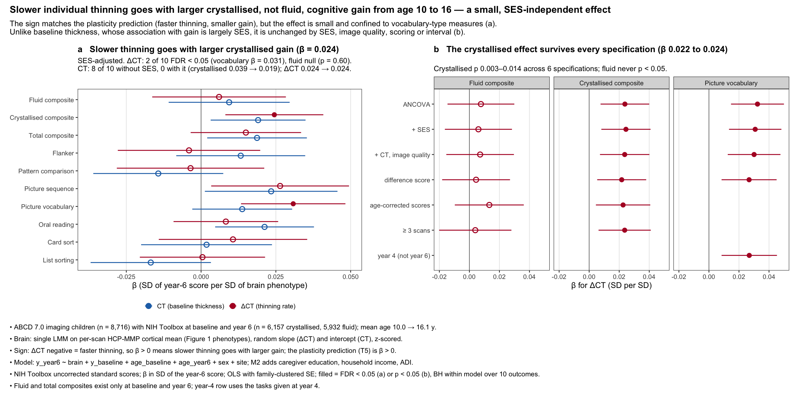

# D4 — Does the individual thinning rate predict cognitive gain?

Direction D4 of [`docs/DIRECTIONS.md`](../../docs/DIRECTIONS.md). It tests prediction **T5**:
if faster adolescent thinning marks an earlier close of cortical plasticity, faster thinners
should gain less cognitively between ages 10 and 16, given where they started.

*Exploratory; run 2026-09-30 on ABCD 7.0. Every number below is a row of
[`results/d4_assoc.tsv`](results/d4_assoc.tsv) or [`results/d4_sample.tsv`](results/d4_sample.tsv).*



## Answer

**The sign matches T5, but the effect is small and confined to crystallised measures.**

- Slower thinning goes with a larger **crystallised** gain: β = +0.024 (+0.008, +0.041), p 0.0034 SD of the
  year-6 score per SD of thinning rate, SES-adjusted (n = 5,807). The effect
  comes mainly from **picture vocabulary** (+0.031 (+0.013, +0.048), p 0.00054). These are the only
  two of ten measures that pass FDR.
- The **fluid** composite is null (+0.006 (-0.016, +0.028), p 0.6), and so are its tasks (flanker, pattern
  comparison, card sort, list sorting). The measures T5 is most about, the plasticity-heavy
  executive and processing-speed tasks, show nothing.
- The crystallised effect is robust. It is unchanged by SES (M1 +0.024 → M2
  +0.024), by baseline thickness and image quality (M3 +0.024), by
  a difference-score model in place of ANCOVA (DIFF +0.022, p 0.0093),
  by age-corrected scores (+0.023), and by restricting to children with
  ≥ 3 scans (+0.024). The vocabulary effect replicates over the shorter
  baseline → year-4 interval (+0.027 (+0.008, +0.045), p 0.0043).
- **Baseline thickness behaves differently.** Without SES it predicts gain on
  8 of 10 measures (crystallised +0.039);
  with SES, on 0 (crystallised +0.019).
  So the thickness–gain association is mostly socioeconomic, and the rate–gain association
  is not.
- **Size.** β ≈ 0.024 of a year-6 SD. Baseline and year-6 crystallised scores
  correlate at r = 0.78, so this is about 0.04 SD of
  *residualised gain* (under 0.2 % of its variance). It is a population-level
  association, not an individual predictor.

## How to read it against the tempo account

1. **Direction.** Consistent with T5: faster thinners gain slightly less. T5 is not
   falsified.
2. **Domain.** The effect sits on crystallised/vocabulary measures. Those are the most
   environmentally and educationally loaded measures in the battery, and the ones the EA
   polygenic score predicts best. EA also predicts *slower* thinning (README Key findings).
   The simplest reading is therefore that a shared EA-type influence acts on both the
   thinning rate and vocabulary growth, rather than a plasticity window closing. SES
   adjustment does not remove it, but SES adjustment does not remove genetic confounding.
3. **Level, not only gain.** Slower thinners already have slightly higher crystallised
   scores at age 10 (LEVEL_BASE +0.029 (+0.006, +0.051), p 0.014). ANCOVA and difference score agree, so this is
   not a Lord's-paradox artefact, but the association runs through both level and change.
4. **Concurrency.** The slope is estimated over the same baseline → year-6 window as the
   gain, so this is coupled development, not prediction. With 2–4 scans there is no way to
   estimate an early thinning rate and test whether it forecasts later gain.
5. Sex interaction (crystallised): -0.033, p 0.039, FDR 0.29 — nominal
   only, and not interpreted.

**Next tests that would separate these readings** (both in `docs/DIRECTIONS.md`):
- the EA score (not yet copied from CSD3) as a covariate, and the PRS triangle
  (EA → slope, EA → gain, slope → gain | EA);
- the D3 MZ-difference design (does the faster-thinning MZ twin gain less vocabulary?),
  which removes shared genetic and family confounding.

## Results table (β in SD of the year-6 score per SD of brain phenotype; † = FDR < 0.05 within model)

| outcome | n | ΔCT, M1 | ΔCT, M2 (+SES) | ΔCT, M3 (+CT, QC) | CT, M1 | CT, M2 |
|:--|--:|:--|:--|:--|:--|:--|
| Fluid composite | 5,932 | +0.008, p 0.5 | +0.006, p 0.6 | +0.007, p 0.53 | +0.039, p 0.00019 † | +0.009, p 0.36 |
| Crystallised composite | 6,157 | +0.024, p 0.004 † | +0.024, p 0.0034 † | +0.024, p 0.0048 † | +0.039, p 1.6e-06 † | +0.019, p 0.018 |
| Total composite | 5,892 | +0.015, p 0.11 | +0.015, p 0.11 | +0.015, p 0.11 | +0.043, p 5e-07 † | +0.019, p 0.028 |
| Flanker | 7,088 | +0.002, p 0.88 | -0.004, p 0.74 | -0.003, p 0.78 | +0.039, p 0.00039 † | +0.013, p 0.23 |
| Pattern comparison | 7,037 | -0.005, p 0.67 | -0.004, p 0.78 | +0.000, p 0.99 | +0.011, p 0.3 | -0.014, p 0.2 |
| Picture sequence | 7,314 | +0.024, p 0.039 | +0.026, p 0.025 | +0.026, p 0.031 | +0.044, p 7.7e-05 † | +0.023, p 0.038 |
| Picture vocabulary | 7,352 | +0.032, p 0.00032 † | +0.031, p 0.00054 † | +0.030, p 0.00078 † | +0.042, p 1.4e-06 † | +0.014, p 0.11 |
| Oral reading | 7,311 | +0.010, p 0.25 | +0.008, p 0.35 | +0.007, p 0.45 | +0.039, p 2.6e-06 † | +0.021, p 0.012 |
| Card sort | 7,075 | +0.018, p 0.16 | +0.011, p 0.4 | +0.013, p 0.32 | +0.026, p 0.019 † | +0.002, p 0.87 |
| List sorting | 7,306 | +0.006, p 0.58 | +0.000, p 0.97 | +0.000, p 0.99 | +0.013, p 0.19 | -0.017, p 0.1 |

ΔCT = thinning rate (negative = faster), so β > 0 means slower thinning, larger gain.
Sample: 8,716 imaging children; 6,157 with crystallised and
5,932 with fluid scores at both waves; mean age 10.0 →
16.1 y (interval 6.1 y). Median slope reliability
0.36.

## Design

- **Brain phenotypes:** the Figure 1 phenotypes. `mean_ct ~ age_c + sex + (1 + age_c | subject)
  + (1 | site)` on the per-scan HCP-MMP cortical mean (run `out/thickness_hcp_70_aa6e91efba82`,
  26,946 scans), as in `genetic_analysis/fig1_prep_1lmm.R`. Random slope = ΔCT, random
  intercept = CT, each z-scored over 8,716 children.
- **Outcomes:** NIH Toolbox uncorrected standard scores (`nc_y_nihtb`). The fluid and total
  composites exist only at baseline and year 6, because Card Sort was not given at years 2
  or 4 and List Sorting was not given at year 2. So baseline → year 6 is the primary
  interval for every measure.
- **Models** (OLS, site fixed effects, SE clustered on family; β divided by SD of the
  outcome):
  - M1: `y_y6 ~ brain + y_base + age_base + age_y6 + sex + site`
  - M2: M1 + caregiver education (5 levels) + household income (6 levels + missing) + ADI
    national percentile, all at baseline
  - M3: M2 + both brain phenotypes + log1p mean topological defects
  - DIFF: difference score
  - LEVEL_BASE: baseline score only
  - SEX_INT: brain × sex
  - M1_Y4: baseline → year 4
  - M1_AGECORR: age-corrected scores
  - M1_3SCANS: children with ≥ 3 scans
  - Multiple testing: BH within each model across the 10 outcomes.

## Reproduce (repo root)

```bash
python directions/d4_cognitive_gain/code/01_scan_means.py            # env abcd-spatial
Rscript directions/d4_cognitive_gain/code/02_fit_1lmm.R              # env r (lme4)
python directions/d4_cognitive_gain/code/03_assoc.py                 # env abcd-spatial
Rscript directions/d4_cognitive_gain/code/fig_d4_cognitive_gain.R    # env ahba-pls-r
```

`work/` holds per-child intermediates and is gitignored. Only aggregate tables are
committed. Inputs are from the vendored release: `nc_y_nihtb.tsv`, `le_l_adi.tsv` (release
root), `g/dyn/ab_g_dyn.tsv` (age, caregiver education, income) and `y/mr_y_qc__post__aut.tsv`.
