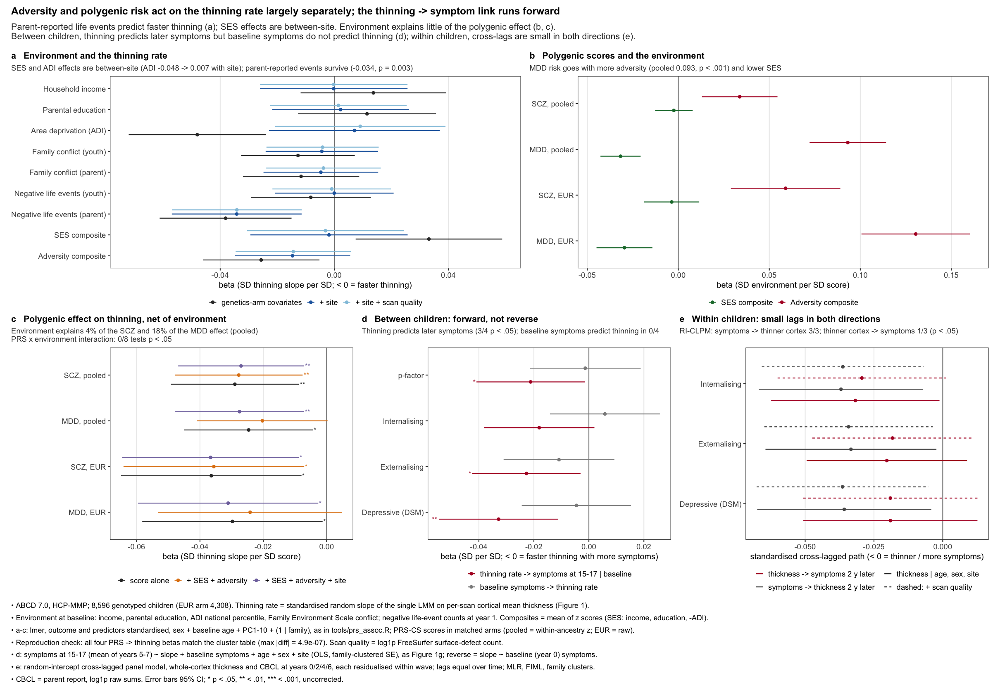

# D5 — Environment, polygenic risk, and the direction of the thinning–symptom link

*Direction D5 of [`docs/DIRECTIONS.md`](../../docs/DIRECTIONS.md). Run 2026-09-30 on ABCD
7.0, HCP-MMP, the 8,596-child genetics analysis set (EUR arm 4,308). Exploratory.*

**Questions.** (1) Do adversity and socioeconomic status act on the same pace
variable as polygenic risk — additively, or interactively — and does the environment
account for the polygenic effect? (2) Does the association between thinning and
symptoms run from thinning to later symptoms, or from earlier symptoms to thinning?



## Findings

Every number below is a row of `results/table_d5_*.tsv`. β is SD per SD. The thinning
rate is the standardised single-LMM random slope, so **β < 0 means faster thinning**.

1. **Reproduction.** The four PRS-CS → thinning-rate cells match the cluster table
   exactly (SCZ pooled −0.029, SCZ EUR −0.036, MDD pooled −0.024, MDD EUR −0.029;
   max |diff| 5e-7; `table_d5_A0_reproduction.tsv`).
2. **SES and area deprivation relate to the rate only between sites.** With the
   genetics-arm covariates, higher ADI goes with faster thinning (−0.048, p 9e-5) and
   the SES composite with slower thinning (+0.033, p 0.011). Both vanish with site
   fixed effects (ADI +0.007, p 0.65; SES −0.002, p 0.89). The slope phenotype's trait
   LMM has a site *intercept* but no site *slope*, so between-site differences in rate
   remain in it. In this design the SES–rate association cannot be separated from
   scanner or site differences in rate. It is not evidence for or against an SES
   effect.
3. **Within site, SES acts on level, not rate — the mirror image of the polygenic
   scores.** SES predicts baseline thickness (+0.062, p 6e-5 with site), whereas the
   SCZ/MDD scores predict the rate and not the level (Figure 1f).
4. **Parent-reported negative life events predict faster thinning, robustly.** Year-1
   parent-reported bad-event count: −0.038 (p 0.001), −0.034 with site (p 0.003), and
   unchanged with scan quality added (−0.034, p 0.003; n 6,630). The youth-reported
   count is null (−0.008 → 0.000). Family conflict (youth or parent) is null in every
   variant. The adversity composite, −0.026 (p 0.014), weakens to −0.015 (p 0.16) with
   site.
5. **Gene–environment correlation is real for MDD, weak for SCZ.** The MDD score goes
   with more adversity (pooled +0.093, p 4e-18; EUR +0.130) and lower SES (−0.032 /
   −0.030). The SCZ score goes with adversity (+0.034 / +0.059) but not SES (−0.002 /
   −0.004).
6. **The environment explains little of the polygenic effect.** Adding SES and
   adversity changes the pooled SCZ β from −0.029 to −0.028 (4 % attenuation;
   bootstrap Δ −0.0012, 95 % CI −0.0028 to −0.0002). SCZ stays significant (p 0.007),
   and the EUR arm is unchanged (2 %). MDD attenuates more (pooled 18 %, Δ −0.0043, CI
   −0.0080 to −0.0013; EUR 19 %, CI crosses 0). The MDD attenuation does not survive
   site adjustment (pooled β −0.028 with SES + adversity + site), so it is the same
   between-site component as finding 2.
7. **No PRS × environment interaction.** 0 of 8 PRS × {SES, adversity} terms reach
   p < 0.05 (largest |β| 0.019, SCZ EUR × SES, p 0.18).
8. **Between children, the association runs forward.** Faster thinning predicts more
   symptoms at 15–17 given baseline (depressive −0.033 p 0.003; externalising −0.023
   p 0.024; p-factor −0.021 p 0.035; internalising −0.018 p 0.078). These associations
   are unchanged with SES and adversity in the model (depressive −0.033, p 0.0025).
   Baseline symptoms do **not** predict the subsequent thinning rate: 0 of 4 outcomes,
   all |β| ≤ 0.011, and 0 of 4 with environment adjusted.
9. **Within children, the cross-lags are small and point both ways.** In the
   RI-CLPM over the four imaging waves (CFI ≥ 0.997, RMSEA ≤ 0.036), a
   higher-than-usual symptom level precedes thinner-than-usual cortex two years later
   for all three scales (standardised −0.033 to −0.037, p 0.015–0.035). The reverse lag
   (thinner cortex → later symptoms) is nominal only for internalising (−0.032,
   p 0.042) and null for depressive (−0.019, p 0.24) and externalising (−0.020,
   p 0.17). Residualising thickness on scan quality changes none of these by more than
   0.003.

## Reading

- **Polygenic risk and adversity are largely separate inputs.** The SCZ polygenic
  effect is not explained by SES or adversity, and does not depend on them.
  Parent-reported life events have an effect of similar size (−0.034 vs −0.029 per SD)
  that survives site and scan-quality adjustment. Additive action on one pace
  variable fits D5's first question, but the life-events result rests on one
  informant (parent) and one wave (year 1), and the youth report does not replicate
  it.
- **The EA-with-SES check (the specific question in DIRECTIONS.md D5) is not yet run.**
  The EA score exists only on CSD3; see "EA step" below.
- **Direction.** Between children, thinning precedes symptoms and symptoms do not
  precede thinning, which argues against reverse causation at the level of
  individual differences in rate. The within-child symptoms → thickness lag is
  small, significant for all three scales, and not a scan-quality artefact. It
  suggests that periods of higher symptoms are followed by extra cortical thinning.
  It is also the path the RI-CLPM is most likely to get wrong (next bullet), so treat
  it as a lead, not a finding.
- **RI-CLPM caveat.** The model has random intercepts but no random slopes. Thickness
  declines within every child, and children differ in how fast (that difference is
  the phenotype), so each child's slope is absorbed into the within-person
  deviations and the autoregressive paths. A latent-curve model with structured
  residuals (LCM-SR; Curran et al. 2014), which separates slopes from lagged
  deviations, is the correct follow-up before any within-child claim is made.

## Caveats

- Symptoms are parent-report CBCL, log1p raw sums, as in Figure 1g. Youth report,
  PQ-BC and KSADS diagnoses are not used here.
- The environment is measured once, at baseline (life events at year 1, the first PLE
  wave). The PLE questionnaire changes version at year 4, so life events cannot be
  accumulated across the imaging window on a common scale.
- The slope phenotype carries between-site variance in rate (item 2). This matters
  for any environmental variable that differs between sites, not only SES.
- All p values are uncorrected. The tables hold 170 coefficients of interest
  (A1–A4, B1–B3; excluding the reproduction check). 37 have p < 0.005: 21 of them are
  the gene–environment correlations (item 5), 13 are environment → slope or
  thickness rows (items 2–4), 1 is the pooled SCZ effect itself (item 6, p 0.0049),
  and 2 are thinning → later depressive symptoms (item 8). No within-child cross-lag (item 9) reaches p < 0.005.

## Layout and how to run

```
code/01_build_tables.py   environment, PRS, CBCL, per-wave thickness -> out/d5_adversity_direction/ (individual-level, gitignored)
code/02_models.R          A0 reproduction, A1-A4 environment x PRS, B1-B3 direction -> results/table_d5_*.tsv
code/fig_d5.R             figures/fig_d5_adversity_direction.png, from the tables only
results/                  coefficient tables only (no individual-level data)
```

From the repo root:

```bash
~/.claude-science/conda/envs/abcd-spatial/bin/python directions/d5_adversity_direction/code/01_build_tables.py
PATH=~/.claude-science/conda/envs/r/bin:$PATH Rscript directions/d5_adversity_direction/code/02_models.R     # ~1 min; lme4, lavaan
PATH=~/.claude-science/conda/envs/ahba-pls-r/bin:$PATH Rscript directions/d5_adversity_direction/code/fig_d5.R
```

Inputs: the 7.0 tables `ab_p_demo`, `le_l_adi`, `fc_y_fes`, `fc_p_fes`, `mh_y_ple`,
`mh_p_ple` (at the release root), `p/mh_p_cbcl`, `y/mr_y_qc__post__aut`; the genetics
export `genetic_analysis/work/results_70tab_hcp/prs_final_1lmm/pheno/`; PRS-CS
profiles under `genetic_analysis/work/scores_scz2025/` and
`legacy/hpc_v2/work/results_v2/prs_final/PRSCS/`; the HCP fit
`out/thickness_hcp_70_aa6e91efba82/`. Variable definitions are in the docstring of
`01_build_tables.py`.

### EA step (pending: needs the CSD3 score file)

The EA polygenic score (Okbay 2016; EUR discovery, so EUR arm only) is scored on
CSD3 and not mirrored locally. Copy it, from `~/Git/abcd_development`:

```bash
rsync -av --include='*/' --include='score_*.profile' --exclude='*' \
  rajd2@login.hpc.cam.ac.uk:/home/rajd2/rds/hpc-work/abcd_development/legacy/hpc_v2/work/results_v2/prs_final/PRSCS/EA/ \
  legacy/hpc_v2/work/results_v2/prs_final/PRSCS/EA/
```

Then rerun the three commands above. `01_build_tables.py` picks up `EA_eur`,
`02_models.R` adds it to every section (A0 checks it against the cluster β +0.0395),
and the figure adds an "EA, EUR" row. The question is whether the EA effect, which
has the opposite sign to SCZ/MDD, survives SES; this is the confound that
DIRECTIONS.md D5 and D3 flag.
