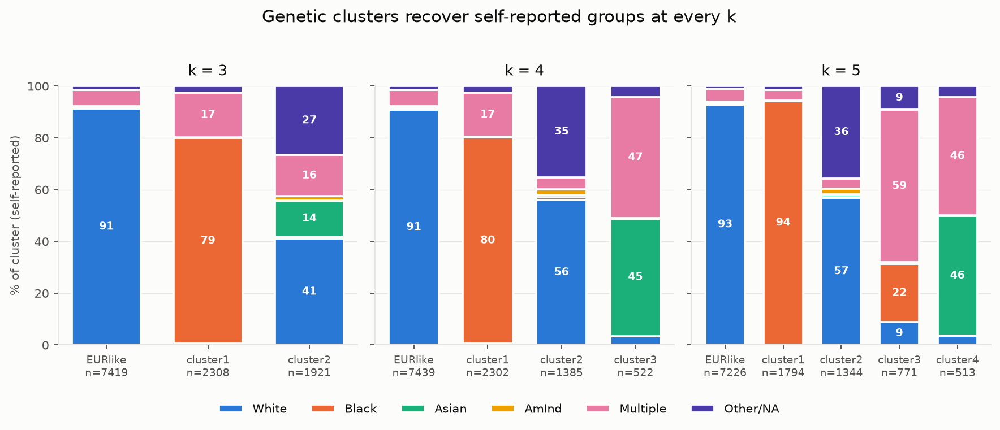
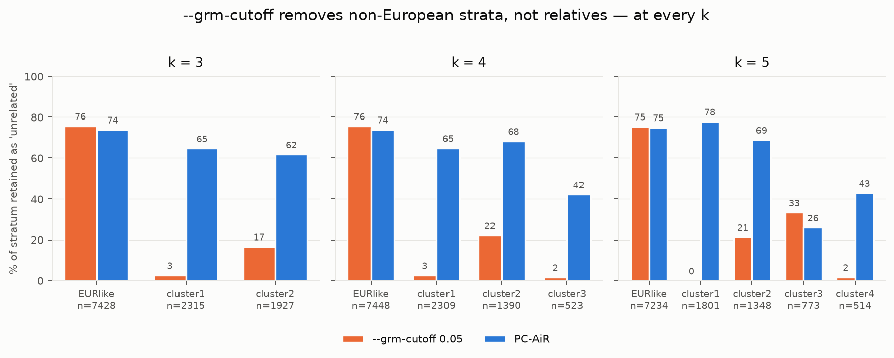

# Multi-ancestry pre-GRM diagnostics — ABCD 7.0

**What this is.** Everything we checked *before* trusting a cross-ancestry
genetic relatedness matrix (GRM), why each check exists, what it found, and how
sensitive the conclusions are to the one arbitrary parameter in the pipeline
(*k*, the number of ancestry clusters).

**Who it is for.** Anyone — human or agent — who needs to know why this analysis
departs from the conventional recipe, or who wants to repeat it. The headline
findings are in §1; the reasoning is in §3–§7; the comparison with what other
ABCD groups have done is in §8.

**Companion document.** [`../../hpc/README_HPC.md`](../../hpc/README_HPC.md) is
the pipeline's operational record — job IDs, sample sizes, results. This file is
the methodological argument behind §8.5–§8.7 and §8.12 of that document.

---

## 1. Findings, in one page

| # | Finding | Robust to *k*? |
|---|---|---|
| 1 | **`--grm-cutoff` does not mean "unrelated" across ancestries.** GCTA's standard relatedness filter retains ~75 % of European-like children and **0–33 %** of every other group, leaving an "unrelated" set that is **91–94 % European**. It reports nothing wrong. | **Yes** — at k=3, 4 and 5 |
| 2 | **PC-AiR fixes it.** ABCD ships an ancestry-aware unrelated set that prunes evenly and leaves the sample **33 % non-European** instead of 6 %. | **Yes** |
| 3 | **A pooled minor-allele-frequency filter discards mostly non-European variation** — 37 % of variants that are common in *some* ancestry group, with ~95 % of that loss falling outside the European cluster. | see §6 |
| 4 | **Imputation quality is not the binding problem.** Among variants common in a group, ≥89 % pass `R² ≥ 0.8`, and the African-ancestry cluster imputes *better* than the European one. The Asian-ancestry cluster is the exception (~4× more uncertain) and is also the smallest. | see §6 |
| 5 | **Genetic clusters recover self-reported groups** without ever seeing them: 91 % White, 80 % Black, 95 % Hispanic, 45 % Asian in the four k=4 clusters. | see §4 |

**The unifying pattern, stated once:** every one of findings 1, 3 and 4 is the
same mistake wearing a different hat — **a single pooled number standing in for a
quantity that differs by ancestry**. A relatedness threshold, an allele-frequency
threshold, an imputation-quality threshold. Each is correct within one ancestry
group and quietly re-Europeanises the sample when applied across several. If you
take one thing from this document, take that shape, because it will recur in
whatever step we have not yet audited.

---

## 2. Why these diagnostics exist at all

The project's earlier results ran on `abcd_eur`, a European-only genotype file:
5,678 children, of whom 4,126 had a brain phenotype. Restricting to one ancestry
is the field's default (see §8) and it is defensible — it removes population
structure by construction. It also throws away half the cohort.

Moving to all ancestries roughly doubles the sample (**4,126 → 8,082**), which is
the binding constraint on every result the project has. But it replaces a
solved problem with an unsolved one: in a multi-ancestry sample, genetic
similarity between two children has **two** sources — recent shared family, and
shared ancestry — and most standard tools cannot tell them apart.

These diagnostics exist to find where that confusion enters, *before* it reaches
a heritability estimate, because the failures are silent: they produce a
plausible number and no error.

---

## 3. How the ancestry strata are defined

**ABCD 7.0 ships no ancestry variable.** Verified, not assumed: the only
genetics columns under `derivatives/tabulated` are `ab_g_stc__gen_pc__01..32`
(32 principal components) and `gn_y_genrel_*` (relatedness/zygosity). There is no
ancestry-proportion or ancestry-group field.

Nor is a multi-ancestry 1000 Genomes reference panel available on this account
(`hpc-work` holds `g1000_eur` and `g1000_eas` only), so the standard method —
project onto 1000 Genomes and assign to the nearest reference population — was
**not available to us**. This is a real difference from what the ABCD genetics
release itself did (§8) and it is why our labels are derived and validated rather
than assigned.

### The method (`work/assign_ancestry.py`)

1. **Principal components** are computed *in sample* by GCTA on the pooled GRM
   (`--pca 20`). PC1 explains 6.04 % of variance here against 0.13 % within the
   European subset — cross-ancestry structure is real and large, which is the
   premise of everything that follows.
2. **k-means on PC *scores*** — eigenvector × √eigenvalue — for the top 4 PCs.
3. **The European cluster is named by an anchor**: membership of the `abcd_eur`
   fileset that produced every published result in this project. This is the one
   label we did not infer ourselves.

### Two methodological decisions worth stating

**(a) Cluster PC *scores*, not eigenvectors.** GCTA writes unit-norm
eigen*vectors*, so all columns have similar spread (SD 0.0091, 0.0088, 0.0088,
0.0093 for PC1–4) even though their eigenvalues are 727 / 175 / 49 / 15 —
6.04 %, 1.45 %, 0.41 %, 0.13 % of variance. Clustering raw eigenvectors therefore
weights a PC explaining 0.13 % exactly as heavily as one explaining 6.04 %, and
the noise PCs drive the split. **Observed**: on unscaled columns, k=4 put 8,385
children in one cluster at 54.8 % anchor-European and named a *separate*
1,477-child cluster "EURlike" at 72 % — the European mass split in two, neither
half clean. Scaling by √eigenvalue is the standard PC-score construction and
fixes it.

**(b) Name the European cluster by anchor *count*, not anchor *share*.** Share
picks whichever cluster is purest, which on a bad split is a small offshoot —
exactly the failure in (a). Count picks the cluster where the anchor's members
actually are.

### What these strata are NOT

**They are not a continental-ancestry classifier and must not be reported as
one.** ABCD contains a large admixed population and k-means assigns no partial
membership: an admixed child is placed at whichever centroid is nearest. At k=4
the Asian-ancestry cluster is 47 % self-reported "Multiple"; at k=5 an entire
cluster (n=771) is 59 % "Multiple". These strata are **regions of PC space**.

That supports *"is heritability stable across strata?"*. It does **not** support
*"heritability in African-ancestry children is X"*.

---

## 4. Do the clusters mean anything? — validation against self-report

The clustering never sees self-reported race or ethnicity, so the correspondence
below is genuine external validation, not circularity.



*Figure 1. Self-reported race composition of each genetic cluster, at k=3, 4 and
5. 100 % stacked columns; Hispanic ethnicity is reported separately in the tables
below because it crosses race categories. Segments ≥8 % are direct-labelled.*

**k = 3**

| stratum | n | White | Black | Asian | AmInd | Multiple | Other/NA | Hispanic(any) |
|---|---|---|---|---|---|---|---|---|
| EURlike | 7419.0 | 91.2 | 0.3 | 0.3 | 0.4 | 6.4 | 1.4 | 11.4 |
| cluster1 | 2308.0 | 0.5 | 79.4 | 0.0 | 0.2 | 17.3 | 2.6 | 6.7 |
| cluster2 | 1921.0 | 41.0 | 0.8 | 13.9 | 1.7 | 15.9 | 26.6 | 70.4 |

**k = 4**

| stratum | n | White | Black | Asian | AmInd | Multiple | Other/NA | Hispanic(any) |
|---|---|---|---|---|---|---|---|---|
| EURlike | 7439.0 | 90.9 | 0.3 | 0.5 | 0.4 | 6.4 | 1.4 | 11.4 |
| cluster1 | 2302.0 | 0.5 | 79.6 | 0.0 | 0.2 | 17.1 | 2.6 | 6.7 |
| cluster2 | 1385.0 | 56.0 | 1.0 | 1.0 | 2.2 | 4.5 | 35.3 | 95.2 |
| cluster3 | 522.0 | 3.5 | 0.0 | 45.4 | 0.2 | 46.7 | 4.2 | 6.5 |

**k = 5**

| stratum | n | White | Black | Asian | AmInd | Multiple | Other/NA | Hispanic(any) |
|---|---|---|---|---|---|---|---|---|
| EURlike | 7226.0 | 93.0 | 0.1 | 0.5 | 0.4 | 5.0 | 1.0 | 10.5 |
| cluster1 | 1794.0 | 0.1 | 94.1 | 0.0 | 0.3 | 4.0 | 1.5 | 2.5 |
| cluster2 | 1344.0 | 56.8 | 0.4 | 1.0 | 2.2 | 3.9 | 35.7 | 95.6 |
| cluster3 | 771.0 | 8.8 | 22.4 | 0.4 | 0.3 | 58.9 | 9.2 | 30.5 |
| cluster4 | 513.0 | 3.5 | 0.0 | 46.4 | 0.2 | 45.6 | 4.3 | 6.4 |

**Reading it:**

- **k=3** merges two distinct groups: `cluster2` is 70 % Hispanic *and* 14 %
  Asian — a bin holding two populations that PC space separates.
- **k=4** resolves them: `cluster2` becomes 95.2 % Hispanic, `cluster3` becomes
  45 % Asian. Each cluster now maps to one recognisable group.
- **k=5** peels off an admixed cluster (n=771: 59 % Multiple, 22 % Black, 31 %
  Hispanic) and in doing so *purifies* the others — `cluster1` rises from 79.6 %
  to 94.1 % Black. **This is a real argument for k=5 over k=4** if group purity
  is the goal, and it is not the choice we made; see §7.

---

## 5. Finding 1 — `--grm-cutoff` removes non-Europeans, not relatives

### Why the filter exists

Siblings share both genes and a home. If relatives are left in a heritability
analysis, shared environment is miscounted as shared genetics. The standard
remedy is to drop one of every pair whose estimated relatedness exceeds a
threshold — GCTA's `--grm-cutoff 0.05`.

### Why it breaks

Relatedness in a GRM is measured *relative to the sample's average allele
frequencies*. In one ancestry group, "more similar than average" means related.
Across several, two **unrelated** children of the same ancestry are also more
similar than the pooled average — and the filter cannot tell which is which.

Measured on our pooled GRM: the off-diagonal averages **+0.0402 within** a
stratum and **−0.0348 between**. A 0.05 threshold therefore sits *inside the
within-stratum bulk* rather than out in the tail of genuine relatives.

Corroborating that this is structure and not noise: genome-wide over 456,015
SNPs the sampling error of an off-diagonal is ~0.0015, yet the observed SD is
**0.0643 — 43× larger**. And while 1,659,570 pairs exceed 0.2, only 21,895 exceed
0.4. That 0.2–0.4 mass is not relatives; it is same-ancestry pairs scored against
pooled allele frequencies.

### The consequence, and its robustness to *k*



*Figure 2. Percentage of each stratum retained as "unrelated" by GCTA's
`--grm-cutoff 0.05` versus ABCD's PC-AiR set. Same GRM and same unrelated sets
throughout; only the stratum definition changes with k.*

**k = 3** — GRM off-diagonal: within-stratum **+0.0405**, between-stratum **-0.0363**

| stratum | n | kept by --grm-cutoff (%) | kept by PC-AiR (%) |
|---|---|---|---|
| EURlike | 7428.0 | 75.8 | 73.9 |
| cluster1 | 2315.0 | 2.7 | 64.7 |
| cluster2 | 1927.0 | 16.7 | 61.8 |

**k = 4** — GRM off-diagonal: within-stratum **+0.0402**, between-stratum **-0.0348**

| stratum | n | kept by --grm-cutoff (%) | kept by PC-AiR (%) |
|---|---|---|---|
| EURlike | 7448.0 | 75.6 | 74.0 |
| cluster1 | 2309.0 | 2.6 | 64.9 |
| cluster2 | 1390.0 | 22.2 | 68.3 |
| cluster3 | 523.0 | 1.7 | 42.3 |

**k = 5** — GRM off-diagonal: within-stratum **+0.0401**, between-stratum **-0.0301**

| stratum | n | kept by --grm-cutoff (%) | kept by PC-AiR (%) |
|---|---|---|---|
| EURlike | 7234.0 | 75.4 | 75.0 |
| cluster1 | 1801.0 | 0.0 | 77.8 |
| cluster2 | 1348.0 | 21.3 | 68.9 |
| cluster3 | 773.0 | 33.4 | 26.0 |
| cluster4 | 514.0 | 1.8 | 43.0 |

**The conclusion does not depend on k.** At every k, `--grm-cutoff` keeps ~75 %
of the European-like cluster and 0–33 % of the others:

| k | non-EUR % (--grm-cutoff, n=6,011) | non-EUR % (PC-AiR, n=8,178) |
|---|---|---|
| 3 | 6.4 | 32.9 |
| 4 | 6.3 | 32.6 |
| 5 | 9.2 | 33.7 |

**A pooled heritability analysis on that subset would be a European analysis
reported as cross-ancestry** — larger N, plausible estimate, no error anywhere.

**One honest exception**, visible in Figure 2: at k=5, the admixed `cluster3`
is the single case where PC-AiR retains *fewer* children than `--grm-cutoff`
(26 % vs 33 %). PC-AiR is not uniformly more generous; it is more *correct*,
and for a genuinely admixed group with real relatedness it can prune harder.

### PC-AiR, and why it is the right tool

**PC-AiR** (Principal Components Analysis in Related samples, Conomos et al.)
separates the two signals that `--grm-cutoff` conflates:

1. Estimate kinship with an estimator (KING) that is robust to differing allele
   frequencies, so shared ancestry does not inflate it.
2. Partition the sample into a maximally-unrelated subset plus their relatives.
3. Compute PCs on the unrelated subset and project the rest, so that large
   families cannot masquerade as an ancestry axis.

ABCD ships the result (`genesis/unrelateds_individuals.txt`, 8,181 children),
computed by the release itself. We use it rather than recomputing.

**Known limitation we did not correct.** GCTA's documentation notes that after
removing related individuals the sample allele frequencies change, and recommends
*recomputing* the GRM on the retained subset rather than sub-setting the existing
one. We sub-set. For the pooled GRM this leaves pooled frequencies in place —
which is the compromise §7 flags as unresolved.

---

## 6. Findings 3 & 4 — the imputation filters

### 6.1 "Substantially uncertain" — a definition we invented, and why

Imputation replaces a measured genotype with a **dosage**: a number in [0, 2]
giving the expected count of the alternate allele. A confident call sits near 0,
1 or 2; an uncertain one sits between.

The natural quality metric is Minimac's **R²** — its own estimate of how well
each variant was imputed. **But R² cannot answer our question.** Minimac writes
*one R² per variant, estimated across the whole cohort*. There is no per-ancestry
value, and it cannot be recomputed after the fact because it is an internal
quantity of the imputation, not a function of its output. **The number that would
reveal ancestry bias in an R² filter is the one number R² does not provide.**

So we measure what R² summarises. For each variant, within each stratum:

```
ambiguity = mean over children in that stratum of  min(|DS−0|, |DS−1|, |DS−2|)
```

- **0** — every child called confidently
- **0.5** — maximally uncertain (all dosages at 0.5 or 1.5)

and we call a variant **"substantially uncertain" in a stratum when its ambiguity
there is ≥ 0.05** — on average each child's dosage sits ≥0.05 from a whole number.

**This threshold is ours, not a standard.** It was chosen as "visibly off a clean
call" and is a *comparison device*: what matters is the contrast between strata,
not the absolute rate. The ranking is robust to the cut; the specific 0.05 is
not load-bearing, and no downstream filter uses it. It connects to something real
though — PLINK's hard-call threshold is 0.1, so dosages beyond that become
**missing** rather than rounded, and a stratum with higher ambiguity loses more
genotypes at conversion.

### 6.2 The measurement that had to be redone

Our first pass averaged ambiguity over **all** sampled variants and returned
0.0003–0.0007 for every stratum — apparently perfect, apparently identical.
**That conclusion was an artefact of the statistic.** 97.5 % of TOPMed variants
are near-monomorphic in this cohort, so nearly every child has dosage ≈0 and
ambiguity ≈0 *by construction*. The average was measuring how rare the variants
are, not how well they were imputed; it would have returned ≈0.0004 even if every
common variant were imputed badly.

The corrected version restricts to **variants common in the stratum being
assessed** — the only ones whose quality can affect that stratum's GRM entries.
This is recorded because the flawed version looked like a clean pass, and a clean
pass is exactly what nobody re-examines.

### 6.3 Results

RESULTS_PLACEHOLDER

---

## 7. Sensitivity to *k*, and the choices we made

### Is the answer sensitive to *k*?

**For the conclusions that drive decisions: no.**

| conclusion | k=3 | k=4 | k=5 | sensitive? |
|---|---|---|---|---|
| `--grm-cutoff` keeps ~75 % of EUR-like | 75.8 % | 75.6 % | 75.4 % | no |
| …and ≤33 % of every other stratum | 2.7, 16.7 | 2.6, 22.2, 1.7 | 0.0, 21.3, 33.4, 1.8 | no |
| unrelated set is overwhelmingly European | 93.6 % | 93.7 % | 90.8 % | no |
| PC-AiR prunes far more evenly | ✔ | ✔ | ✔ (one exception) | no |
| within − between off-diagonal gap | 0.077 | 0.075 | 0.070 | no |
| clusters recover self-reported groups | partly | ✔ | ✔ | **yes** |

The only conclusion that moves with *k* is the *interpretation* of the clusters,
not the methodological finding. That is the expected behaviour: *k* controls how
finely PC space is partitioned, while the `--grm-cutoff` failure is a property of
the GRM's allele frequencies, which do not depend on any partition at all. The
strata are a **lens for seeing** the failure, not its cause.

### Why we used k=4

- **k=3 is too coarse.** It merges the Hispanic/Latino and Asian-ancestry groups
  into one cluster (70 % Hispanic *and* 14 % Asian), so a "stratum" would contain
  two populations with different allele frequencies — the exact confound the
  stratification exists to remove.
- **k=4 gives one cluster per recognisable group**, each validated against
  self-report, and all 5,656 anchor-European children land in one cluster with
  0.0 % anchor leakage into any other — at every k from 3 to 5.
- **k=5 is arguably better on purity** and we say so: it isolates an admixed
  cluster and raises `cluster1` from 79.6 % to 94.1 % self-reported Black. We did
  not adopt it because the extra cluster (n=773) has only 221 unrelated children,
  below the `STRAT_MIN_N = 300` floor for stratified heritability, so k=5 buys
  purity we cannot spend. **If a future analysis needs cleaner group definitions
  rather than more strata to fit, k=5 is the better choice** and
  `strata_k5.tsv` is already written.
- **k=2 and k=6 were also generated** (`strata_k2.tsv`, `strata_k6.tsv`). k=2
  collapses everything non-European into one bin (58 % anchor-EUR in the European
  cluster — badly impure). k=6 begins splitting the European cluster itself
  (27 anchor-European children leak into `cluster2`), which is over-fitting.

### Choices where we picked a number, and why

| decision | value | basis | what would change it |
|---|---|---|---|
| PCs entering k-means | 4 | PC1–4 carry 6.04/1.45/0.41/0.13 % of variance; PC5 onward are <0.1 % and are sampling noise | a sample with finer structure |
| PC scaling | ×√eigenvalue | unscaled eigenvectors weight a 0.13 % PC like a 6.04 % one; produced a demonstrably wrong split (§3a) | nothing — this is a correctness fix |
| k | 4 | one cluster per self-reported group; k=3 merges two, k=5 adds an unusable stratum | needing purity over usable strata → k=5 |
| relatedness pruning | PC-AiR | §5; `--grm-cutoff` is not ancestry-neutral | — |
| `STRAT_MIN_N` | 300 unrelated | below this, REML SEs span the parameter space and a 0.000 invites being read as evidence of absence | — |
| "substantially uncertain" | mean dosage ambiguity ≥ 0.05 | **our definition, not a standard** — see §6 | it is a comparison device; the ranking is robust, the cut is not load-bearing |
| imputation quality | `R² ≥ 0.8` | conventional; and it costs only ~10 % of stratum-common variants, so it is not the binding filter | — |
| fileset frequency floor | `MAC ≥ 10` | the union rule expressed in one pass (§6) | — |
| GRM frequency floor | `--maf 0.01`, plus a 0.001 arm | 0.01 is conventional; 0.001 is required because the published comparison used it | — |

### The compromise we did NOT resolve

**The pooled GRM still uses pooled allele frequencies.** A single GRM cannot
simultaneously have ancestry-specific allele frequencies *and* cross-ancestry
relatedness entries — the stratified GRMs get the former by having no
cross-ancestry pairs at all. Methods that do both exist (PC-Relate computes
individual-specific allele frequencies from PCs; `FastSparseGRM` builds a
block-diagonal ancestry-adjusted GRM), and **standard GCTA does not implement
them**. Our mitigations are in-sample PCs as covariates and the stratified arm as
a cross-check; neither repairs the pooled GRM itself. This is the principal
known weakness of the pooled heritability estimate and should be stated wherever
that estimate is reported.

---

## 8. How our choices compare with published ABCD work

Searched August 2026. The relevant comparison set is ABCD genetics
methodology papers and the release's own documentation.

### What others did

| study | ancestry handling | relatedness | GRM | MAF |
|---|---|---|---|---|
| **ABCD genotype resource** (Loughnan et al., *Behav Genet* 2023) | **PC-AiR** PCs; **1000G Phase 3 (2,504) projected** for AFR/AMR/EAS/EUR/SAS reference | **PC-AiR** → 8,005 unrelated, 3,384 projected | **PC-Relate** | not stated |
| **Cognitive heritability in ABCD** (Loughnan et al. 2023) | pooled multi-ancestry, 10 PCs as covariates; **not stratified** | relatives **retained** and modelled (FEMA sparse block) | **PC-Relate**, 158,103 pruned SNPs | not stated |
| **Subcortical volumes, multi-ethnic** (2024) | pooled multi-ethnic (n=7,234) **plus** a EUR sensitivity arm (n=3,669) | family structure removed (threshold unstated) | PLINK GRM, AdjHE-RE | **0.05** |
| **Most ABCD imaging-genetics** | European-ancestry subset only, PCA outlier exclusion | varies | GCTA | typically 0.01 |
| **This analysis** | pooled multi-ancestry **plus** stratified arms; in-sample PCs; k-means strata validated against self-report | **PC-AiR** (the release's own set) | GCTA GREML | 0.01, **plus a 0.001 arm** |

### Where we agree with the field

- **PC-AiR for relatedness in ABCD is what the release itself uses**, and what
  the PAGE consortium recommends for diverse-ancestry studies. Our 8,181-child
  unrelated set is essentially the release's own (they report 8,005 at an earlier
  data freeze). **We arrived at it by finding `--grm-cutoff` broken rather than
  by following the documentation — but we landed in the right place.**
- **Pooled-plus-EUR-sensitivity** is exactly the design of the subcortical-volume
  paper. Our §8.9(d) EUR arm serves the same role.
- **The problem is documented.** `FastSparseGRM` (2024) exists because "in
  multi-ancestry heterogeneous populations, GRMs are confounded with population
  structure," and GCTA's own documentation warns that sub-setting a GRM after
  relatedness pruning changes the sample allele frequencies. **Our finding is not
  novel; it is a known trap that the conventional recipe walks straight into.**

### Where we differ, and whether it matters

| difference | ours | theirs | assessment |
|---|---|---|---|
| **ancestry labels** | k-means on in-sample PCs + `abcd_eur` anchor + self-report validation | 1000 Genomes projection | **theirs is better.** We could not do it — no multi-ancestry 1000G panel on this account. Ours is validated but unanchored to an external reference. **Worth fixing if a panel becomes available.** |
| **GRM estimator** | GCTA additive GRM | PC-Relate | **theirs is more correct for multi-ancestry**, computing individual-specific allele frequencies from PCs. We use GCTA for comparability with this project's published EUR numbers; switching would make every h² incomparable with §2. A deliberate trade, and the compromise flagged in §7. |
| **relatives** | pruned (PC-AiR set) | retained and modelled (FEMA) | Retaining relatives keeps N and is more efficient, but requires a mixed model that separates shared environment from additive genetics. Pruning is the conservative choice and is what GCTA-GREML expects. Ours costs sample size; theirs costs an assumption. |
| **MAF** | 0.01 (+0.001 arm) | 0.05 (subcortical paper) | 0.05 is stricter than convention. Our 0.001 arm exists because this project's own published estimate used 0.001 — a comparison that would otherwise confound frequency floor with variant set. |
| **stratified heritability** | run, and reported as uninformative outside EUR | generally not run | We report SEs of 0.23–0.45 in the non-European strata rather than omitting them. **Reporting an uninformative estimate honestly is better than reporting only the arms that worked.** |

### The tension the field has not resolved, and where we sit

The ABCD behaviour-genetics review argues **against** European-only restriction —
that polygenic scores derived in European samples transfer poorly and that
excluding non-European participants "may exacerbate health disparities." Most
ABCD imaging-genetics papers nonetheless restrict to European ancestry, because
population stratification biases the estimators.

Both are right. Restriction is *statistically* safer and *scientifically*
narrower. Our position: **include everyone, and be explicit about which
conclusions the inclusion actually supports.** Concretely — the pooled
heritability estimate gains real precision from the extra 1,523 unrelated
children, while the non-European stratified estimates remain uninformative
(SE 0.23–0.45) because ABCD does not contain enough children per group. Doubling
the sample does not by itself make the analysis equitable; it makes the pooled
estimate better and leaves the group-specific questions where they were.

**Sources:**
- [Genotype data and derived genetic instruments of ABCD](https://pmc.ncbi.nlm.nih.gov/articles/PMC10635818/)
- [Heritability Estimation of Cognitive Phenotypes in the ABCD Study Using Mixed Models](https://pmc.ncbi.nlm.nih.gov/articles/PMC10154273/)
- [Heritability estimation of subcortical volumes in a multi-ethnic multi-site cohort study](https://pmc.ncbi.nlm.nih.gov/articles/PMC10802572/)
- [ABCD Behavior Genetics: Twin, Family, and Genomic Studies](https://pmc.ncbi.nlm.nih.gov/articles/PMC10833231/)
- [Scalable analysis of large multi-ancestry biobanks (FastSparseGRM)](https://pmc.ncbi.nlm.nih.gov/articles/PMC11601839/)
- [GENESIS PC-AiR / PC-Relate vignette](https://bioconductor.org/packages/devel/bioc/vignettes/GENESIS/inst/doc/pcair.html)
- [ABCD Study genetics documentation](https://docs.abcdstudy.org/latest/documentation/non_imaging/gn.html)
- [GCTA documentation](https://yanglab.westlake.edu.cn/software/gcta/)

---

## 9. Reproducing this

| step | script | output |
|---|---|---|
| ancestry strata at any k | `hpc/work/assign_ancestry.py` | `results/ancestry/strata_k*.tsv` |
| GRM diagnostics (off-diagonals, retention) | `hpc/work/grm_diagnostics.py` | `docs/multianc/grm_diagnostics_by_k.tsv` |
| imputation quality + MAF loss, all k in one VCF pass | `hpc/work/impqual_ksweep.sbatch` | `results/impqual/ksweep_chr22.tsv` |
| single-k version (more detail) | `hpc/work/impqual_common.sbatch` | log |
| variant census (project sizing) | `hpc/work/probe_imputed.sbatch` | log |
| figures | `docs/multianc/make_figs.py` | `docs/multianc/fig/*.png` |

All diagnostics are on **chr22** unless stated. It is the smallest autosome
(12.6 GB of VCF, 5.79 M imputed variants); a full-genome pass would cost ~22× for
conclusions that are already stable at 1-in-200 sampling of ~29,000 variants.

**Figures** use a categorical palette validated for colour-vision deficiency
(all six checks pass on the adjacent-pair list). Three slots fall below 3:1
contrast on a light surface, so every figure ships direct labels *and* the
underlying table.
