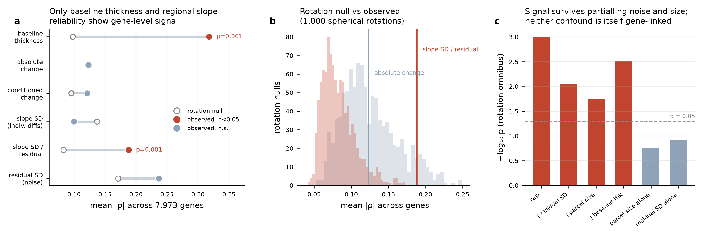

```{python}
#| include: false
import sys, os
from pathlib import Path
ROOT = Path("..") if Path.cwd().name == "notebooks" else Path(".")
sys.path.insert(0, str(ROOT / "src"))
import numpy as np, pandas as pd, scipy.stats as st
import matplotlib.pyplot as plt
from abcd import spatial as sp, genemaps as gm

RUN_ABS = ROOT / "out" / "thickness_dsk_70_36738d15ec02"   # DK, absolute change
pd.set_option("display.width", 100)
```

## What this notebook tests, and what a wrong answer would look like

Hypothesis (ii) of the project: the genes driving adolescent cortical
development should be linked to the transcriptional axes we already have — AHBA
component C3 from Dear et al. (2024) and PC1 of the single-nucleus maturation
data.

The natural test is a spatial correlation: does the map of where cortex changes
during adolescence resemble the map of C3? This is the test most such papers
run, and it is easy to run it wrongly in a way that produces a publishable
p-value from nothing. Two failure modes, both addressed below:

1. **Spatial autocorrelation.** Cortical maps are smooth. Two independent smooth
   maps correlate far above what a naive permutation null expects, because
   permuting region labels destroys smoothness and so builds a null of *rough*
   maps that no real map resembles. Quantified in @sec-nulls: the naive null
   gives false-positive rates of 0.24–0.58 at nominal 0.05.
2. **Projection bottleneck.** Going from a map to genes via a small set of
   precomputed components confines the answer to a low-dimensional subspace of
   gene space regardless of the map. Quantified in @sec-bottleneck.

## The spatial null {#sec-nulls}

```{python}
geom = sp.load_dk_geometry(ROOT / "data" / "dk_centroids.csv")
lh = [l for l in geom.labels if l.startswith("lh_")]
geom_lh = sp.ParcelGeometry(
    labels=tuple(l[3:] for l in lh),
    coords=geom.coords[[geom.labels.index(l) for l in lh]],
    space="sphere", hemi=tuple(["lh"] * len(lh)))
print(f"{len(geom.labels)} parcels ({len(lh)} left)")
```

The null we use is the **spin test**: rotate the parcel centroids rigidly on the
sphere and reassign each rotated parcel to a real one. This preserves the map's
spatial autocorrelation exactly, because it is the same map, just turned.

One implementation detail matters enough to state. The common shortcut assigns
each rotated centroid to its nearest original by independent nearest-neighbour
lookup. That is *not* a permutation — some parcels get used several times and
others not at all — which distorts the null's variance. We solve the assignment
as a bijection (`scipy.optimize.linear_sum_assignment`), so every rotation is a
genuine relabelling:

```{python}
S = sp.spin_indices(geom_lh, n_perm=200, seed=0, hemi_paired=False)
print(f"unique targets per rotation: {np.mean([len(np.unique(r)) for r in S]):.1f} of {len(geom_lh.labels)}")
```

Calibration on synthetic smooth maps with known-zero true correlation:

```{python}
cal_path = ROOT / "out" / "spatial_calibration.csv"
if cal_path.exists():
    print(pd.read_csv(cal_path).to_string(index=False))
else:
    print("run analysis/spatial_calibration.py to regenerate")
```

The naive null's false-positive rate rises with map smoothness — exactly the
pathology described above — while the spin test stays at or below nominal. Any
map-to-map claim in this project uses the spin null.

## Is the developmental map worth testing at all?

Before interpreting any null result we need to know the map is not noise.
Split-half over subjects:

```{python}
fa = pd.read_parquet(RUN_ABS / "fits" / "fixed.parquet")
dev_abs = fa[fa.term == "age_c"].set_index("label").estimate
print(f"{len(dev_abs)} regions | thinning {(dev_abs < 0).sum()} | thickening {(dev_abs > 0).sum()}")
print(f"lh/rh symmetry: {sp.hemisphere_symmetry(dev_abs, geom):.3f}")
```

Left–right symmetry of a real cortical map should be high, since the two
hemispheres develop similarly; this map's symmetry confirms it is measuring
something anatomical rather than noise. A previously-run split-half over
subjects gave ρ = 0.975 for this map — essentially noise-free. **So any
negative result below is not a measurement-error result.**

## Map-level test against AHBA components

```{python}
MC = ROOT / "out" / "map_vs_ahba_components.csv"
if MC.exists():
    print(pd.read_csv(MC).round(4).to_string(index=False))
```

The developmental change maps show no reliable correlation with C1–C3. The
positive control does: **baseline thickness vs C1, ρ = −0.58, p_spin = 0.001.**
That control matters — it shows the machinery detects real map-to-map structure
when it is present, so the negative result on change is about the change map,
not about the method.

## The projection bottleneck {#sec-bottleneck}

The gene-level version of the test used to run: map → correlate with C1/C2/C3 →
weight genes by their component loadings → compare to snRNA-seq PC1. That is
also negative, but the negative is uninformative, and it is worth seeing why.

```{python}
W = gm.ahba_gene_weights()
G = W.to_numpy()
G = G / np.linalg.norm(G, axis=0)
print(f"gene weights: {W.shape[0]} genes x {W.shape[1]} components")
print("pairwise |cos| between component loading vectors:")
print(pd.DataFrame(np.abs(G.T @ G), index=W.columns, columns=W.columns).round(3))
```

The loading vectors are near-orthogonal, so the three components span a genuine
3-dimensional subspace — and any map's gene ranking, obtained as a weighted sum
of three fixed vectors, lies entirely inside it. Whatever map you feed in, the
gene ranking is determined by three numbers. That is a property of the method,
not of the biology, and it means a null result here says nothing about whether
genes relate to the map.

## Direct per-gene analysis on the full expression matrix

Removing the bottleneck requires the full gene-by-region matrix, which the AHBA
repo provides in the Dear et al. (2024) processing:

```{python}
E = gm.ahba_expression()          # validates row order internally -- see below
print(f"expression: {E.shape[0]} regions x {E.shape[1]} genes")
```

The source file indexes regions by integer code with no names attached, so row
order cannot be assumed. `ahba_expression` validates it by reconstructing the
published component scores as z(expression) @ loadings and requiring agreement
(ρ = 0.998 / 0.974 / 0.912 for C1/C2/C3); it raises otherwise. Row misalignment
is the failure mode that invalidates every downstream number while producing no
error message.

### Why the omnibus, not the per-gene p-values

Correlating a map with 7,973 genes and counting how many pass p < 0.05 is
tempting and wrong. Genes share expression gradients, so a map that happens to
align with the dominant gradient produces thousands of "significant" genes from
a single underlying alignment. The raw count for the change map was 800 genes at
p < 0.05 against 399 expected — which looks like 2× enrichment and is not.

The fix is to make the null a null over *maps*: rotate the map, recompute the
entire gene correlation vector, and compare the observed summary statistic
(mean |ρ| across genes) to its rotation distribution. Gene–gene dependence is
then absorbed, because it is present identically in observed and null.

```{python}
OMNI = ROOT / "out" / "gene_level_omnibus.csv"
if OMNI.exists():
    print(pd.read_csv(OMNI).round(4).to_string(index=False))
```

Reading that table:

- **Baseline thickness** is strongly gene-linked (p = 0.001). Positive control passes.
- **Group-mean change**, absolute or conditioned, is not (p = 0.44, 0.17).
- **Slope SD** — the between-subject spread of developmental rate, which is what
  genetics would actually act on — is not either (p = 0.82).
- **Slope SD / residual SD** — a regional signal-to-noise map — *is* (p = 0.001).

### Interrogating the one positive result

A signal-to-noise map is exactly the kind of quantity that could be gene-linked
for uninteresting reasons, so the positive result needs more scepticism than the
negatives. Three checks, all in the table above or in the figure:

1. **Is it the noise denominator?** Residual SD alone: p = 0.118. No.
2. **Is it parcel size?** Parcel size alone: p = 0.177. No — and note that
   parcel size *does* correlate with the ratio map (ρ = +0.40) and with C1
   (ρ = +0.34), so this had to be checked rather than assumed.
3. **Does it survive partialling?** Yes: p = 0.009 conditioning on residual
   noise, 0.018 on parcel size, 0.003 on baseline thickness.



**But one diagnostic argues against over-reading it.** The ratio map's
left–right symmetry is 0.35, where real cortical maps in this dataset run above
0.9. A map that disagrees with itself across hemispheres is likely dominated by
estimation noise in the variance components — and variance components are
exactly what is estimated worst when most subjects have two visits. My
assessment is that this result is *provisional pending release 7.0*: the honest
statement is that it survived every confound test we could construct and still
failed the symmetry check, and the symmetry check is the one that improves
automatically with more timepoints.

## What this means for the project's hypothesis

The negative map-level result does **not** refute hypothesis (ii), because the
map-level test is not the test the hypothesis needs. Where cortex thins *on
average* is a group-level anatomical fact; whether SCZ/MDD risk genes are
enriched in the genetic architecture of *individual differences* in development
is a question about association signal, answered by GWAS of the subject-level
phenotype followed by competitive gene-set testing. That is the `hpc/` pipeline,
and it is independent of everything in this notebook.

The right summary is: the group-mean developmental map is reliable, is not
transcriptionally patterned in a way these components capture, and the
individual-difference maps that would be transcriptionally patterned are not yet
estimated well enough on release 5.1 to say. Both conclusions point at the same
next step.
